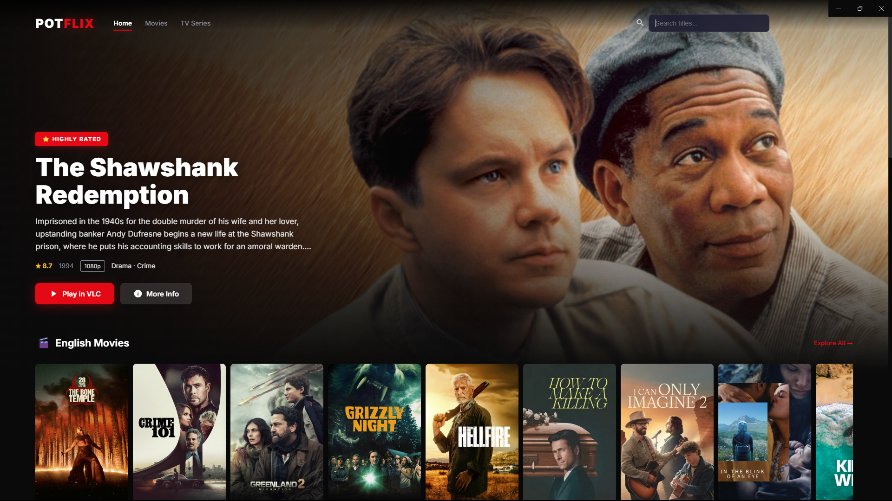

<div align="center">
  <h1>🍿 PotFlix Streamer</h1>
  <p><strong>A sleek, Netflix-inspired desktop application for browsing and streaming movies directly from local FTP servers via VLC Media Player.</strong></p>

  <br />
  
  <br /><br />

  <p>
    <a href="https://reduan.vercel.app/" target="_blank">♥ By Reduan</a>
  </p>
</div>

<br />

## 🎉 What's New in v2.0.0
- **Native YouTube Trailers**: A seamless "Watch Trailer" button automatically fetches official TMDB trailers and plays them in a beautiful 16:9 cinematic dark overlay.
- **Smart Search Deduplication**: Searching intelligently merges identical movies across different FTP resolution folders, automatically presenting the highest-available video quality.
- **Exact-Year Metadata Matching**: The TMDB search algorithm strictly maps release years to guarantee precise metadata (fixing mismatches between big Hollywood classics and contemporary regional remakes).
- **UI & Layout Polish**: Resolved visual padding bugs across Browse, Search, and Category views for a flawless presentation underneath the transparent navigation bar.

---

## ✨ Features
- **Netflix-Style Interface**: Beautiful, responsive, dark-mode UI with hero banners, custom sliders, and smooth animations.
- **Instant VLC Integration**: Streams high-quality media (1080p, 4K) directly from the FTP server straight to VLC Media Player with auto-play capabilities.
- **Smart Metadata Matching**: Automatically pairs FTP folder names with **TMDB** (The Movie Database) to pull high-res posters, backdrop art, ratings, and plot overviews.
- **Embedded YouTube Trailers**: Connects to TMDB to find and embed official auto-playing YouTube trailers right inside the movie popup.
- **Lightning Fast Search**: Fully locally-cached search index with smart quality deduplication (prioritizing 4K/1080p over 720p).
- **TV Series Support**: Automatically groups episodes into seasons, allowing for "Play Season" binge-watching directly in VLC.
- **Smart Year Filtering**: Strictly resolves movie name collisions by intelligently matching release years, pulling accurate metadata even for Regional/Hindi versions of classic movies.

---

## 🚀 Installation & Setup

### Prerequisites
1. **Node.js**: Ensure you have Node.js installed.
2. **VLC Media Player**: Required to stream the videos locally. Ensure VLC is installed on your system (C:\Program Files\VideoLAN\VLC\vlc.exe).

### Development Server

1. **Clone & Install Dependencies:**
```bash
git clone https://github.com/ReduanNurLabid/PotFlix.git
cd PotFlix
npm install
```

2. **Set up TMDB API Key:**
Create a `.env` file in the root directory (you can copy `.env.example`) and add your TMDB API key:
```env
TMDB_API_KEY=your_api_key_here
```
*(You can easily get a free API key from [TMDB](https://www.themoviedb.org/settings/api))*

3. **Start the application:**
```bash
npm start
```

### Building the Executable (.exe)
You can package the application into a standalone Windows installer:
```bash
npm run build
```
Once completed, the setup file will be generated in the `dist/` directory (e.g., `dist/PotFlix Setup 2.0.0.exe`).

---

## 🛠️ Architecture

PotFlix Streamer operates in a dual-architecture:
1. **Express Backend (`server.js`)**: Quietly scrapes your configured local FTP servers, maintains the search cache, and handles all TMDB API proxying in the background.
2. **Electron Frontend (`main.js` & `/public`)**: Renders the modern web UI in a chromeless Chromium window and directly executes `vlc.exe` via child shell processes when playback is requested.

## 🤝 Credits
Designed and Developed by **[Reduan](https://reduan.vercel.app/)**.
*Metadata generously provided by [The Movie Database (TMDB)](https://www.themoviedb.org/).*
